# **S**uper **R**ollo **C**on**tr**o**l** (SRCtrl)

This DIY project creates smart blind control device based on [GW60 SuperRollo](http://www.superrollo-online.de/elektronische-rollladengurtwickler/superrollo-gw60/). The GW60 is extended to enable an easy integration into smart home systems by a smart HW and FW. 

The FW is based on [sonof-tasmota](https://github.com/arendst/Sonoff-Tasmota) and extended by a specific GW60 device driver. A [WEMOS D1 mini](https://wiki.wemos.cc/products:d1:d1_mini) is used as hw extension of the GW60.
  
It's just a smart GW60 extensions and enhancement. All original GW60 functions are still avaliable and working. The HW ideas of the GW60 interface are based on the great work from [Björn Hempel, Uwe, Axel, others](https://www.hempel-online.de/cms/index.php/fhem/articles/umbau-superrollo-gw60-fuer-homematic.html). 

**SRCtrl** offers an additional interface for home automation systems via MQTT. All interfaces offered by sonoff-tasmota also available such as web server OTA ... . 
This DIY project was developed and integrated into my smart home solution based on [iobroker](https://www.iobroker.net/). 

A specific PCB and housing (3D-printed) was created as piggy-back for the GW60 housing to cover my mechanical and functional requirements. The GW60 is used in a surface-mounted and in concealed installations in my privat home.

I tried to follow the rules and principles for the extension of sonoff-tasmota firmware as best as known and understood at that time. But I'm sure some points are missed. Constructive comments and feedbacks are more than welcome.

## Functional requirements

The following smart blind functions should be available via the remote interface

<li> Open / close blind
<li>Move the blind to any position
<li>Monitor the current blind position 
<li>Stop blind movement
</ol>

## Technical and other requirements:
<li>MQTT and WLAN as protocol and communication tecnology</li>
<li>Easy integraion into home automation system</li>
<li>Easy setup</li>

## Tools:
<li>VisualStudioCode:  Firmware development (https://code.visualstudio.com/)</li>
<li>FreeCAD: Housing design (https://www.freecadweb.org/)</li>
<li>Simplify3D: 3D Printing Software (GCode generation)</li>
<li>KiCAD: Scematic and PCB design (http://www.kicad-pcb.org/)</li>

(c) Peter Neeser 2019

# Design

## I/O interfaces to the GW60
  The implemented interfaces of the GW60 extension can be structured into three parts. 
<ul>
<li>Buttons (outputs):</li>
<ul>
<li>GW60 UP button (true/false) - <b>GW60 up</b></li>
<li>GW60 DOWN buttons (true/false) - <b>GW60 down</b></li>
</ul>
<li>Motor (inputs):</li>
<ul>
<li>GW60 Motor is rotating right direction (true/false) - <b>GW60 mot2</b></li>
<li>GW60 Motor is rotating left direction (true/false) - <b>GW60 mot1</b></li>
</ul>
<li>Blind position detection (input):</li>
<ul>
<li>Hall sensor for the GW60 rotation detection of the input-whell - <b>GW60 halls</b></li>
</ul>
</ul>
The I/O-configuration uses the standard sonoff-tasmota web interface. The signals GW60 up, GW60 down, GW60 mot1, GW60 mot2 and GW60 halls have to be assigned to the proper inputs and outputs. 

The two GW60 mounting variants (surfacd mounted and concealed) selected by changing the signals GW60 mot1 and GW60 mot2. See the following pictures for details.

  

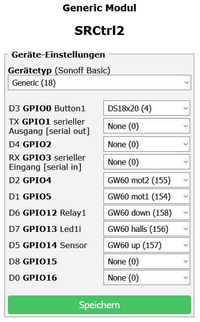* Sonoff-Tasmota Configuration for surface mounted GW60*

 

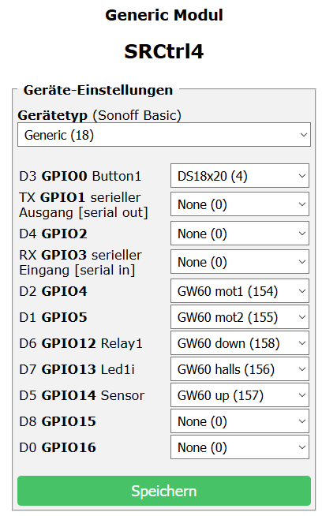* Sonoff-Tasmota Configuration for concealed mounted GW60*
 
 

## Datamodel

| Name | Type | Access | Values | Description |
| --- | --- | --- | --- | --- | --- |
| DOWN | u | r/w | false/true | simulate GW60 down/up button press (true)
| UP | u | r/w | false/true | simulate GW60 down/up button press (true)
| M | u | r | false/true | GW60 motor standstill/rotating (any direction) M = M1 OR M2
| M1 | u | r | false/true | GW60 motor standstill/rotating clockwise direction
| M2 | u | r | false/true | GW60 motor standstill/rotating anti-clockwise direction
| HOME_UP | e | r |false/true | Homing up ok: blind up (open) position (POS==0; SC==0) valid; Homing step 1 ok
| HOME | e | r | false/true | Homing ok:    blind down (closed) position (POS==100; SC==MSC) valid; Homing step 2 ok
| POS | u | r | 0...100 | Blind position (0..100)% only valid if HOME==true
| REFPOS | u | r | -3,...100 | Blind position reference/command value (see details below)
| SC | e | r | 0..500 | Blind position in sensor increments; Only valid if HOME_UP==true
| MSC | e | r | 40..500 | Blind (max)down position in sesor increments; POS scaling factor; Only valid if HOME==true Value is stored in the setup data and read after power on (see details below) 
| SM | e | r | 0.. | State of REFPOS handler (state machine) 

<ul>
<li>Type: u/e - user interface / expert only
<li>Access: r/w - Read / Write
</ul>

## REFPOS

REFPOS is the main and easy to use user interface to be controlled by home automation system. It is used to enter commands or positions. The following table shows supported values.

| REFPOS | Type | Description
| --- | --- | --- 
| -3 | e | Command Manual Homing: Current position is considered as blind open and used to set MSC manualy
| -2 | e | Command Clear Homing: Homing flags HOMING_UP and HOMING are cleared (false); MSC is set to its default 500
| -1 | e | Command Auto Homig: It performces automatic blind up (REFPOS=0) move followed by a blind down (REFPOS=100) move
| 0 | u | Position Up: Open blind (move blind up - controlled by GW60 up limit switch)
| 1..99 | u | Position: Move blind to position 1..99 controlled by position sensor -> Only if HOME==true
| 100 | u | Position Down: Close blind (move blind down - controlled by GW60 down limit switch)

## GW60 mounting
The GW60 has to be mounted following the procedure descriped in the GW60 documentation. The mounting type and limit switches of the GW60 have to be programmed acordingly.

## Homing

### First homing/power on
Homing is required in order to perform positioning of the blind which means move to positions others than 0% (up) or 100% (down). The 0 position and the max position has to be known bei the device. The procedure to get this information is so called "Homing". 

The firmware implements an automatic detection of the homing parameters. This is done if the blind is moved up by setting REFPOS=0 followed by an move down by setting REFPOS=100.
If the device is homed a move to any position (REFPOS=1..99) is accepted and possible. The POS scaling factor (MSC) is remanent stored in the setup data set of the device. After power on MSC is restored but the current blind position (POS) is not available. 
 
 

### Power on (of an already homed device)
If the device is switched on the current position and the POS scaling factor (MSC) is not known in the beginning. During initialization of the device it tries to read the MSC from the setup data set. If a valid (40 <= MSC <500) scaling factor could be found the blind moves automatically up to find the 0 position.
The device is homed again. If an invalid scaling factor was read the device has to be homed again by moving up and down manualy. 
 
 

### Remarks and hints
<ul>
<li>The automatic move up can be stoppeed by pressing any button on the GW60
<li>The scaling factor can be reset with the command REFPOS=-2 (Clear Homing)
<li>If the power returns after an unexpected loos the blind moves up and the homing status is restored
<li>If the device/GW60 is moved and mounted on a different position "Clear Homing" should be performed before dismounting. Otherwise the device could use the scaling factor (MSC) and move up after power on.
</ul>
 
 

## How positioning works
  If hommed the device can be positioned to other positons than open (0%) and close (100%). This is done by using a hall sensor. The sensor detects the rotation of theGW60 input wheel. It detects four impulses/increments for each rotaion of the wheel. Signals from the GW60 motors used to find the direction of the wheel. This is used to compute the current blind position (SC) in sensor increments by the firmware. The scaling factor MSC is used to compute POS and REFPOS in %.
 
 

## Hardware

### Part list
todo

The following picture shows the schematic.

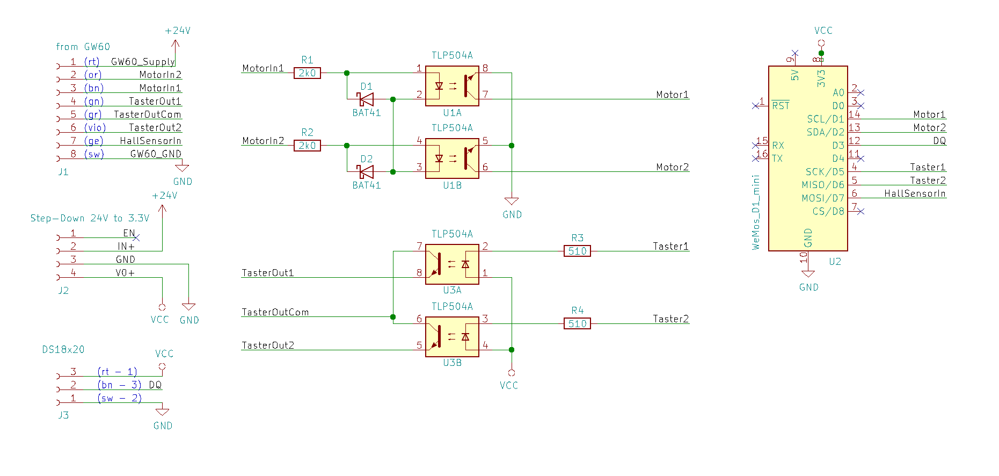* SRCtrl schematic (KiCAD)*
 

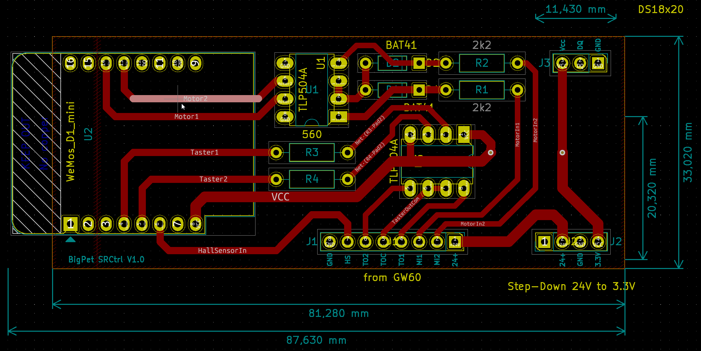* SRCtrl PCB top side (KiCAD)*
 

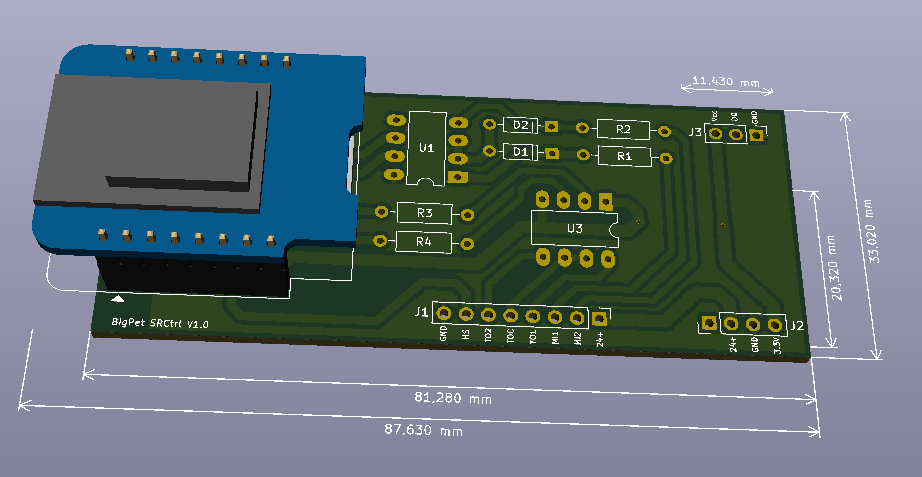* SRCtrl PCB 3D view (KiCAD)*
 

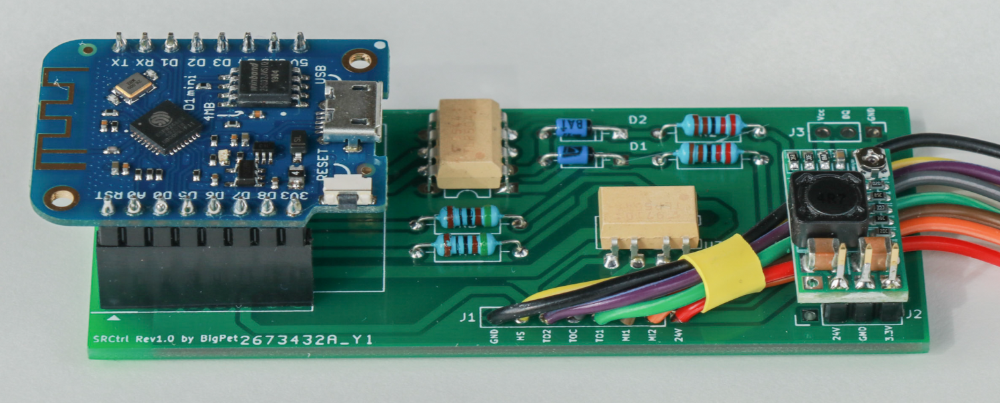* SRCtrl printed board assembly*
 

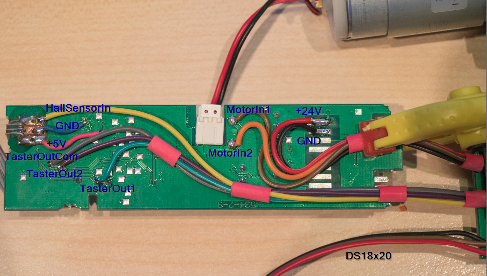* GW60 ctrl-board wiring*
 

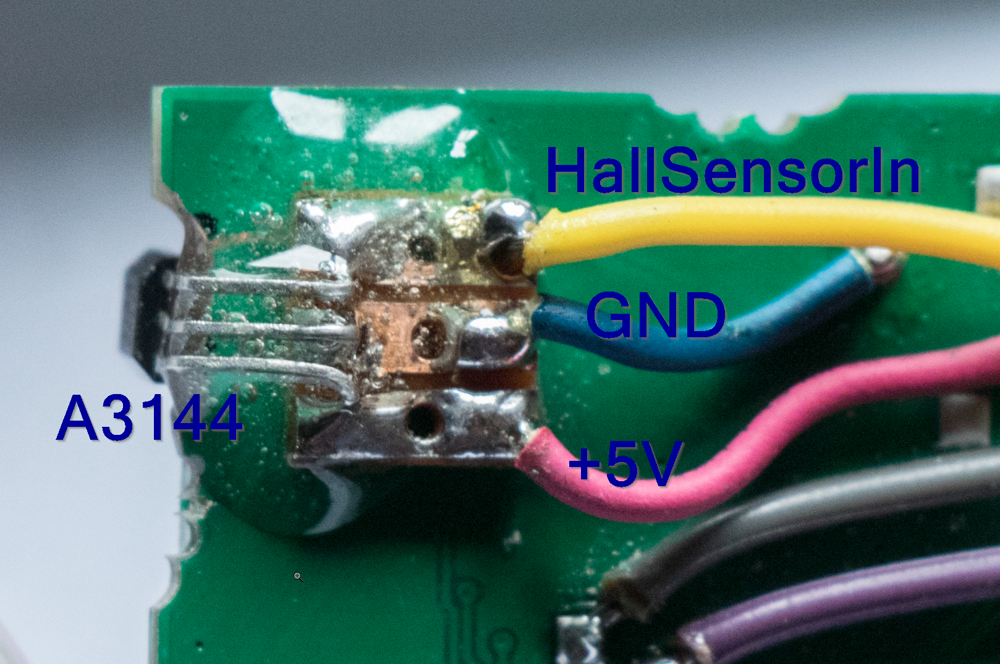* GW60 ctrl-board hall-sensor mounting (detail view)*
 

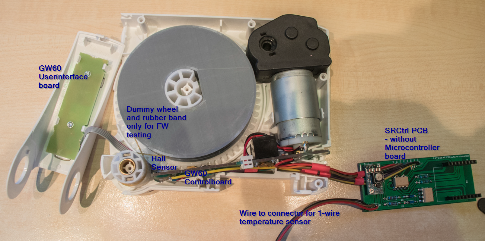* SRCtrl test setup with dummy wheel*
 

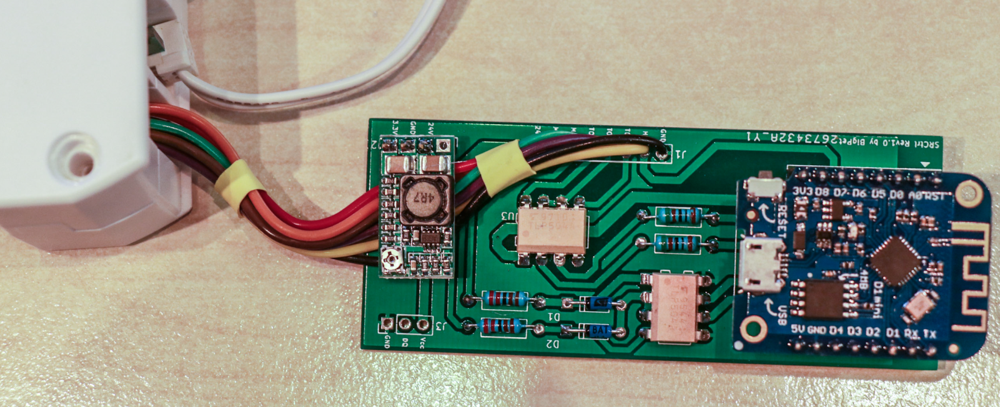* SRCtrl schematic*
 

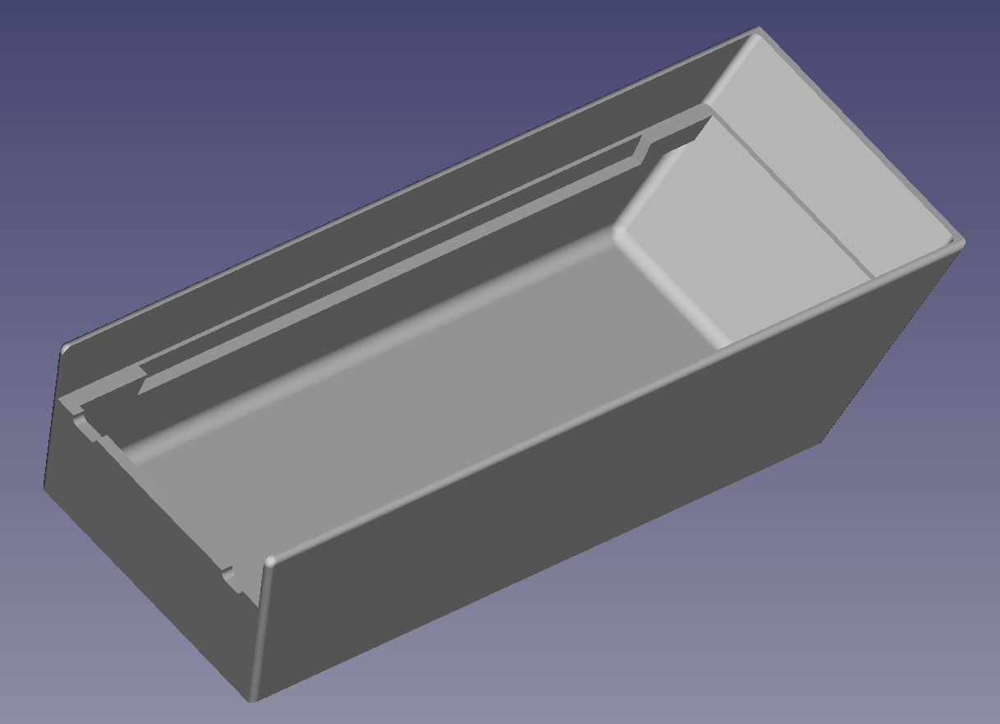* 3D view of the housing*
 

 

### Remark: 
Additional 4.7k pullup which is not placed on the PCB is needed!

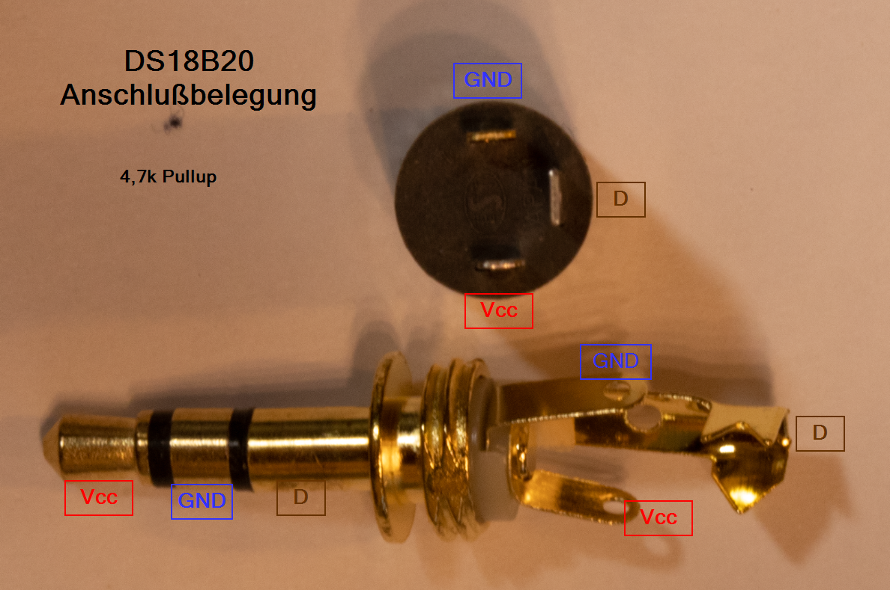* DS18B20 3-Pin 3.5mm PlugConnection*
 

todo

Rev. 2019-11-18 ongoing

