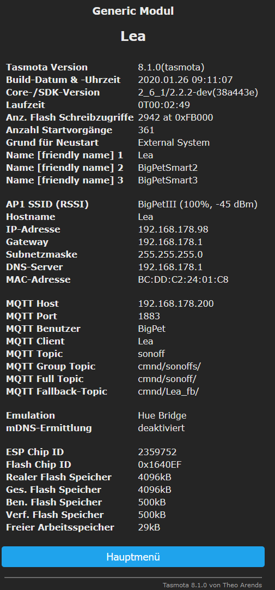

SRCtrl von sonof-Tasmota V6.5 nach tasmota V8.1 

1. Merge user_config_override.h from ghSRCtrl
- als tasmota\user_config_override_SRCtrl_6.5.h bereitstellen
- in .gitignore eintragen
- merge: keine grossen Änderungen; Define-Sektion übernehmen
- v.8.1 -> 8.3 #define MY_LANGUAGE de-DE.h -> de_DE.h

2. -DUSE_CONFIG_OVERRIDE aktivieren
- platformio_override_sample.ini verwenden
    - rename nach platformio_override.ini
    - DUSE_CONFIG_OVERRIDE ist bereits aktiviert

3. upload_port configurieren
    - upload_board in platformio_override.ini anpassen
    -> todo auto detect aktivieren - schnelle versuche waren nicht erfolgreich

4. #warning in user_config_override.h auskommentieren 

5. Quellcode für gw60-Treiber übernehmen
    - copy xsns_91_gw60.ino übernehmen
    - tasmota_template.h "GPIO_GW60" suchen
        - enum UserSelectablePins erweitern 
        - const uint8_t kGpioNiceList[] erweitern
        - texte in const char kSensorNames[] erweitern "D_SENSOR_GW60" suchen
    - tasmota\language\de-DE.h "D_SENSOR_GW60" suchen
        - texte D_SENSOR.... erweitern
    - settings.h erweitern
        - gw60_max_scounter zu "struct { } Setting" hinzufügen
            - einfügen mit even-alignment
            - free_f03[] um 2 Byte reduzieren
   
6. V6.5 -> V8.x
    Änderungen von XdrvMailbox in xsn_91_gw60.ino anpassen
    - wird für debug ausgaben verwendet
    - ToDo nochmals alle Verwendungen auf impact durch Typ-Änderungen prüfen
    - FUNC_WEB_APPEND -> FUNC_WEB_SENSOR in xsn_91_gw60.ino

7. V8.1 -> V8.3 pin[ ] -> Pin() in in xsn_91_gw60.ino

8. GW60 spezifische Verzeichnisse und Files übernehmen
    - Etc, FreeCAD, KiCAD 
    - README_GW60.md
    - README_SRCtrl_Merge.md

==========> 
- Compile ohne Fehler
- download ohne fehler
- Infofenster nach ersten Start

  

Upload per CMD-Line:
aus .\

c:\users\bigpe\.platformio\penv\scripts\python.exe "C:\Users\bigpe\.platformio\packages\tool-esptoolpy\esptool.py" --chip esp8266 --port "COM8" --baud 115200 write_flash 0x0 .pioenvs\tasmota\firmware.bin